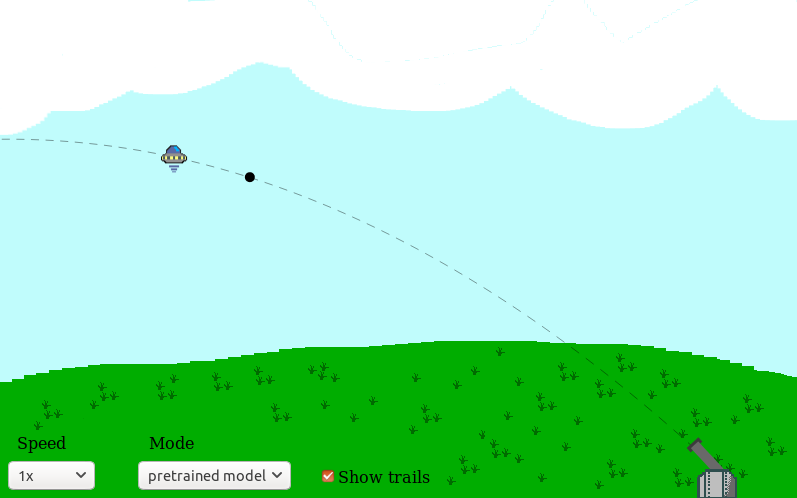

# Neuro-evolution of an anti-aircraft gun

Trains a population of guns to aim at moving targets with projectile motion. You can speed up the training, show the best-so-far, a really good pretrained model or even take manual control and try defending Earth yourself.

